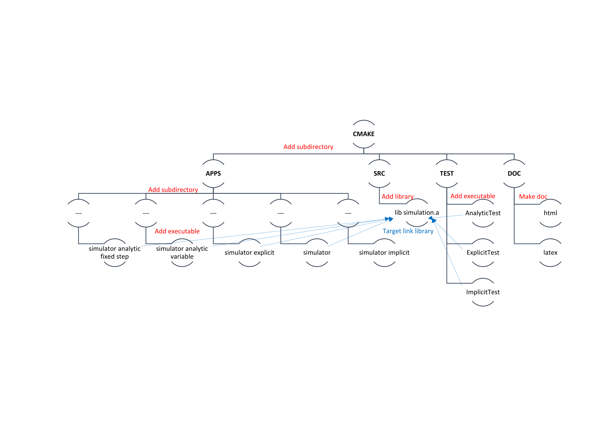

# Simulator neuro-5

## About

A Simulation of Leaky Integrate-and-Fire Neuron models with the Brunel Network activity defined by intra-network or extra-network currents (Event);

## Code Structure 

## External Documentation

- The Brunel Model ( [github](doc/Brunel_2000.pdf) or [doxygen](Brunel_2000.pdf) version )
- Project Description( [github](doc/Project_Description.pdf) or [doxygen](Project_Description.pdf) version )
- An example of Brunel Network in Python ( [here](http://arken.nmbu.no//~plesser/publications/Gewa_2012_533_preprint.pdf) )

## Manual

To execute the default application, run

    ./simulator
in neuro-5/build/apps

To change the type of simulation, enter

	./simulator -m 0 	for AnalyticFixedStep
				   1 	for Explicit
				   2 	for Implicit
				   3 	for AnalyticVariableStep
	
For help and parameters, enter

    ./simulator --help
    

## Misc

### Team Members

- Bruno Magalhaes <bruno.magalhaes@epfl.ch>
- Leo Sumi <leo.sumi@epfl.ch>
- Thais Lindemann <thais.lindemann@epfl.ch> 
- Johannes Brune <johannes.brune@epfl.ch>
- Laure Font <laure.font@epfl.ch> 
- Laurine Kolly <laurine.kolly@epfl.ch>
- Gael Reganha <gael.reganha@epfl.ch>
- Violette Zanotti <violette.zanotti@epfl.ch>
- Julie Brancato <julie.brancato@epfl.ch>
- Fiona Joseph <fiona.joseph@epfl.ch>
- Clara David-Vaudey <clara.david-vaudey@epfl.ch> 

### Links you may find useful 

- Chat room: https://coreneuron.slack.com/
- SCRUM board: https://github.com/EPFL-SV-cpp-projects/neuro-5/#boards
- Development Milestones: https://github.com/EPFL-SV-cpp-projects/neuro-5/milestones

