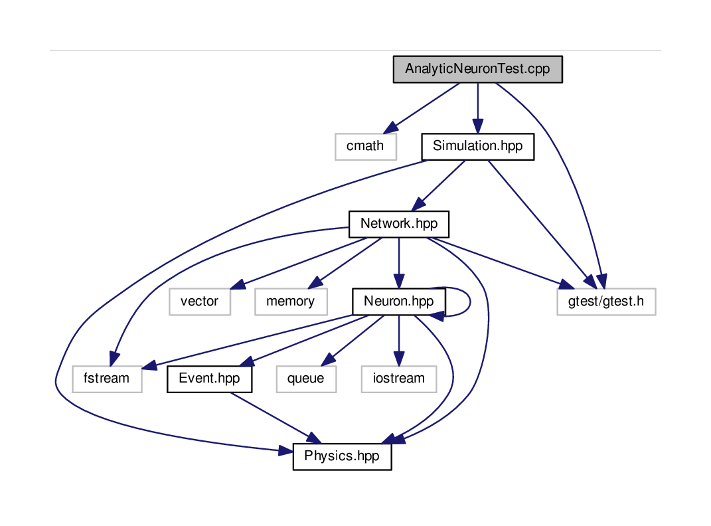
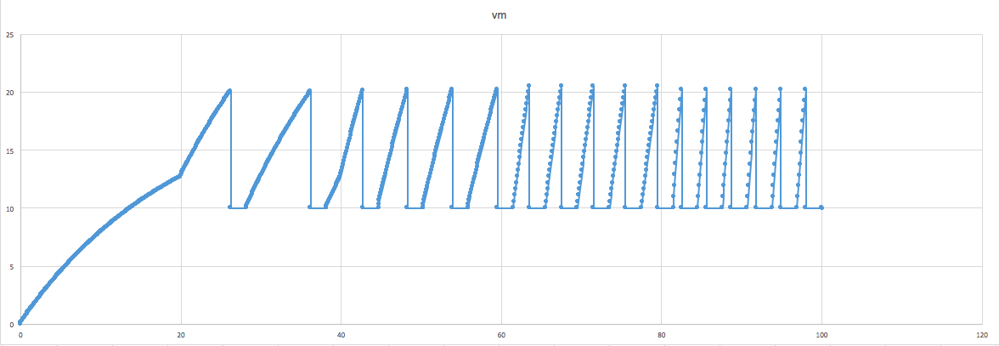

# Source neuro-5

## About 

Library test

## Classes Structure

## Manual 

To execute the test, within the test folder you can run either of the 
following three test

	./simulator_as_test.exe

	./simulator_ifs_test.exe
	
	./simulator_efs_test.exe

## Tests brief explanation

TestThreshold: Test if the threshold has been exceeded or not with a boolean argument

TestResetPotential: Test if the reset of the potential gives the value RESET_POTENTIAL to the potential 

TestSetConnections: Test with 2 neurons if one is connected to the other when adding a connection

TestAddEvent: Test if an Event is correctly added to the queue of Events of a neuron

TestInputRI: Test if the right amplitude of the current is returned when RI is calculated

TestOutput: Test when one neuron fires, if the neuron it's connected to receives an input

TestSynapticConnectivity: Test with 2 neurons if when connecting the first one to the other, the first one has a new 
synapse and if when the first one spikes, the other one receives an input and changes its potential accordingly

TestDecayNeuronVoltage: Test if the decay of the membrane's potential is properly done for a neuron receiving no input

TestRefractoryPeriod: Test if after it as fired, a neuron stays at the resting potential during the refractory period 

TestSingleNeuronSimulation: Test if a simulation with one neuron receiving regular constant excitatory inputs runs successfully

TestVoltageFiringReset: Test if a neuron receiving a stepwise increasing current has a stepwise increasing frequency of spikes

### A current clamp experiment with ascending current injections over time, showing increasing frequency of spiking interval:

